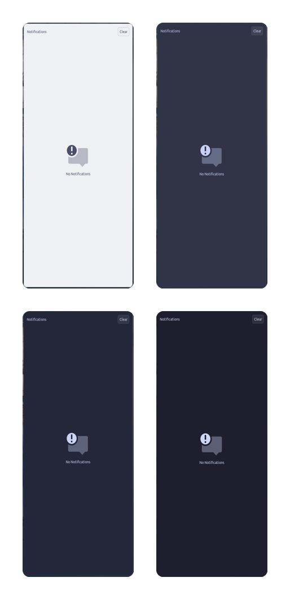
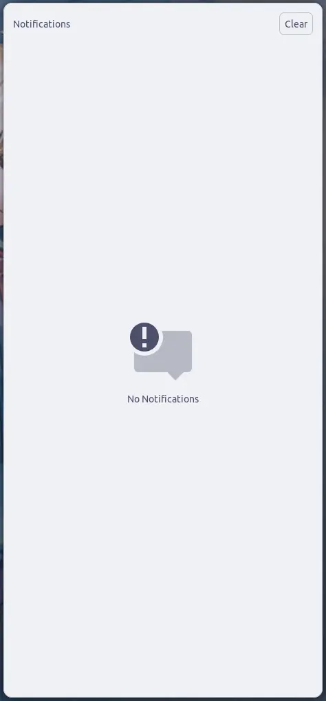
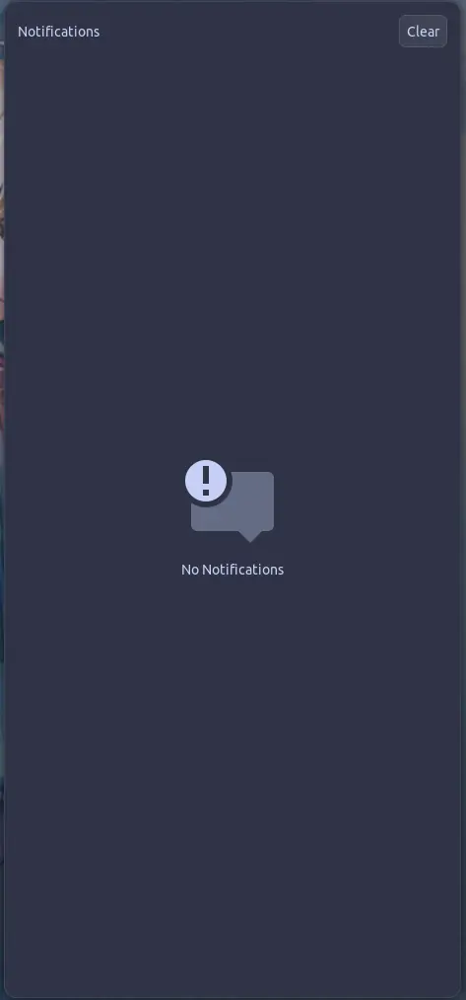
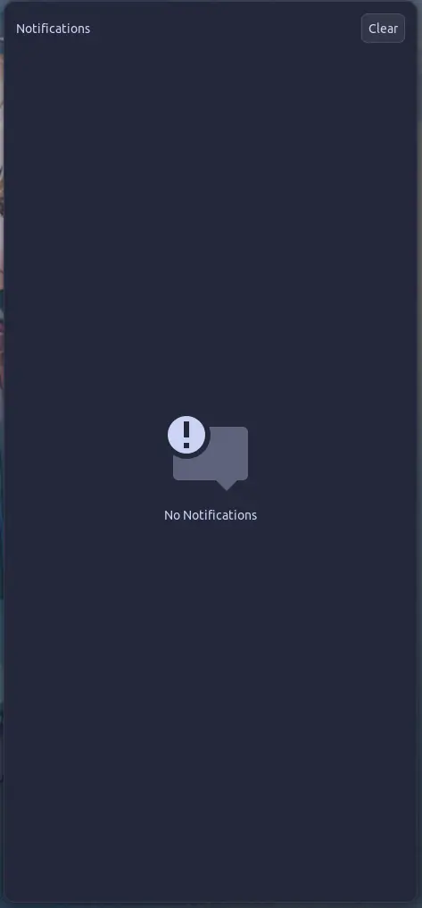
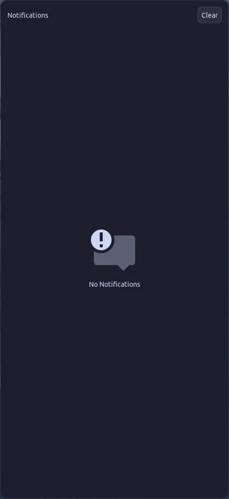

<h3 align="center">
  
 
 Catppuccin for <a href="https://github.com/ErikReider/SwayNotificationCenter">SwayNC</a>
 
</h3>

 
 
 

 

## Previews

🌻 Latte

🪴 Frappé

🌺 Macchiato

🌿 Mocha

## Usage

1. Download your preferred flavour from the [`themes/`](themes/) folder.
2. Put the downloaded file into `~/.config/swaync/`.
3. Add `"cssPriority": "user",` to your `swaync/config.json` config file, to
   prioritise this style!
4. In `~/.config/swaync/style.css`, add the line
   `@import url(catppuccin-<flavor>.css);` at the top of the file.
5. Any personal changes to swaync's styling should now reside in `style.css`.

## FAQ

- Q: I have no idea what I should customise! What do I do now?\
  A: Please use the provided [`templates/style.css`](templates/style.css) file
  if you need a default CSS template to work from. It includes some of the
  default configuration options that was provided in an older version of this
  theme.

## 💝 Thanks to

- [Isabel Roses](https://github.com/isabelroses)
- [Toria](https://github.com/ninetailedtori)

&nbsp;

 

 Copyright &copy; 2021-present <a href="https://github.com/catppuccin" target="_blank">Catppuccin Org</a>

 

