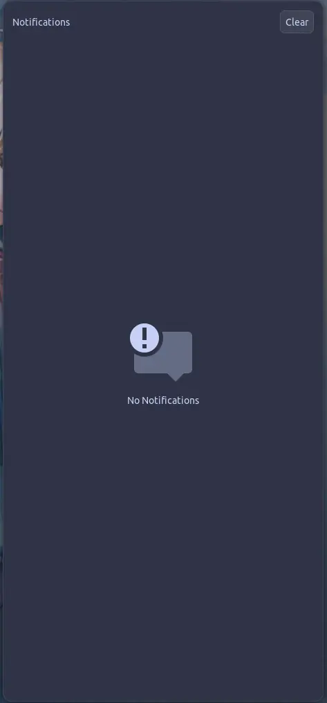

<h3 align="center">
	<br/>
	
	Catppuccin for <a href="https://github.com/ErikReider/SwayNotificationCenter">SwayNC</a>
	
</h3>

<p align="center">
	<a href="https://github.com/catppuccin/swaync/stargazers"></a>
	<a href="https://github.com/catppuccin/swaync/issues"></a>
	<a href="https://github.com/catppuccin/swaync/contributors"></a>
</p>

<p align="center">
	
</p>

## Previews

<details>
<summary>🌻 Latte</summary>

</details>
<details>
<summary>🪴 Frappé</summary>

</details>
<details>
<summary>🌺 Macchiato</summary>

</details>
<details>
<summary>🌿 Mocha</summary>

</details>

## Usage

1. Download your preferred flavor from the [latest release](https://github.com/catppuccin/swaync/releases/latest).
2. Rename the downloaded theme to `style.css` and put it into `~/.config/swaync/`.
3. If you're using a custom font, you will need to change the line `font-family: 'Ubuntu Nerd Font'` to your font of choice.
4. Run `swaync-client -rs` to reload swaync css.
- You can let sway manage your swaync theme:
```sh
set $flavor macchiato
set $version v0.1.2.1
exec_always if [ ! -f ~/.config/swaync/style.css ]; then $(mkdir -p ~/.config/swaync && curl -L https://github.com/catppuccin/swaync/releases/download/$version/$flavor.css -o ~/.config/swaync/style.css); fi
```

## 💝 Thanks to

- [Isabel Roses](https://github.com/isabelroses)

&nbsp;

<p align="center">
	
</p>

<p align="center">
	Copyright &copy; 2021-present <a href="https://github.com/catppuccin" target="_blank">Catppuccin Org</a>
</p>

<p align="center">
	<a href="https://github.com/catppuccin/catppuccin/blob/main/LICENSE"></a>
</p>
